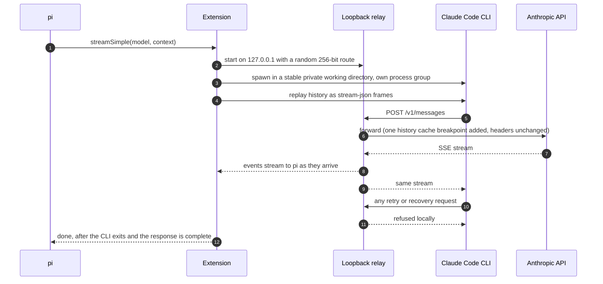

<div align="center">

# oPius

**Because if Hermes can have it, so can we**

Pi + Claude Pro/Max Subscriptions on the official Claude Code CLI. Pi keeps its own agent loop, tools, approvals, and compaction.

[](https://github.com/mandofever78/oPius/actions/workflows/ci.yml) [](https://www.npmjs.com/package/opius) [](LICENSE) [](https://github.com/earendil-works/pi) [](https://www.npmjs.com/package/@anthropic-ai/claude-code) [](https://nodejs.org)

</div>

> [!NOTE]
> This is an unofficial community project, not affiliated with or endorsed by Anthropic. Your use of Claude through it is governed by the terms of your Claude plan.

## Highlights

- **Works with Claude Pro/Max Subscriptions. No extra usage billing required on Opus, Sonnet or Haiku.** It has no credentials of its own: it uses whatever login Claude Code already has and never reads, copies or prints Claude Code's credential files.
- **One pi call, one upstream request.** A single-use loopback relay forwards exactly one Messages request per call and refuses native retries.
- **Requests are barely touched.** The relay adds one cache breakpoint to the conversation history; otherwise bodies are forwarded as the CLI builds them, and Claude Code's identity headers are unchanged.
- **Real streaming.** Text, thinking and tool-call deltas come straight from the upstream SSE stream.
- **Subscription-safe environment.** API keys and backend overrides that would silently switch Claude Code to API billing are removed from its environment.

## Quick start

```sh
# 1. Sign in (skip if `claude auth status` already shows your Pro/Max plan)
claude auth login --claudeai

# 2. Install the extension
pi install npm:opius

# 3. Run pi on Opus 5.5, the extension's default model
pi --model claude-subscription/claude-opus-5-5
```

Inside pi, run `/claude-subscription` to check the login, and `/model` to switch models (search for "Claude subscription").

Opus 5.5 is the extension's default model. It is the provider's first model, so it leads the provider's entries in `/model`. It is also the model pi starts with when you have no saved default and no other provider signed in. A saved `defaultModel`, a `--model` flag, or a resumed session always takes precedence.

## Requirements

| | Version | Notes |
| --- | --- | --- |
| [pi](https://github.com/earendil-works/pi) | 0.87.1+ | Check with `pi --version` |
| [Claude Code](https://www.npmjs.com/package/@anthropic-ai/claude-code) | 2.1.280 (qualified) | Must be signed in to a **Pro or Max** plan |
| Node.js | 22.19+ | Only needed to run this repo's tests |
| OS | Linux, macOS | On Windows, use WSL (see [Limitations](#limitations)) |

## Authentication

The extension uses Claude Code's own login. Choose **one** of these options.

<details open>
<summary><b>Browser login</b> (desktop)</summary>

```sh
claude auth login --claudeai
```

Sign in with the account that holds the subscription. Keep the `--claudeai` flag: `--console` logs in to an Anthropic Console account instead, and requests would then be billed as API usage.

</details>

<details>
<summary><b>Long-lived token</b> (headless machines, CI, containers)</summary>

On any machine with a browser:

```sh
claude setup-token
```

On the machine that runs pi:

```sh
export CLAUDE_CODE_OAUTH_TOKEN=<token>
```

Treat the token like a password. Keep it out of shell history and out of dotfiles committed to git.

</details>

<details>
<summary><b>Dedicated config directory</b> (keeps this login separate from your everyday Claude Code profile)</summary>

```sh
CLAUDE_CONFIG_DIR=~/.claude-pi claude auth login --claudeai
export CLAUDE_SUBSCRIPTION_CONFIG_DIR=~/.claude-pi
```

</details>

Verify the login with `claude auth status`. You should see `"loggedIn": true`, `"authMethod": "claude.ai"` and a `subscriptionType`.

## Installation

```sh
pi install npm:opius                                  # every session
pi install git:github.com/mandofever78/oPius          # every session, latest from GitHub
pi install -l git:github.com/mandofever78/oPius       # this project only
pi -e git:github.com/mandofever78/oPius               # one run, not installed
```

Uninstall with `pi remove` and the same source. The extension has no runtime dependencies.

## Usage

```sh
pi --model claude-subscription/claude-opus-5-5                        # default model
pi --model claude-subscription/claude-opus-5-5:high                   # with a thinking level
pi --model claude-subscription/claude-sonnet-5                        # another model
pi -p --model claude-subscription/claude-opus-5-5 "summarize README.md"
pi --list-models claude-subscription
```

`--provider` on its own does not choose a model in pi; it only narrows `--model`. To start every session on this provider, select Opus 5.5 in `/model` and press `Ctrl+S`, or set `defaultProvider` to `claude-subscription` and `defaultModel` to `claude-opus-5-5` in `~/.pi/agent/settings.json`.

### Models

| Model | Context | Thinking "off" |
| --- | :---: | :---: |
| `claude-opus-5-5` (default) | 1M | always thinks |
| `claude-sonnet-5` | 1M | ✓ |
| `claude-opus-5` | 1M | always thinks |
| `claude-opus-4-8` | 1M | ✓ |
| `claude-fable-5-1` | 1M | always thinks |
| `claude-haiku-4-5-20251001` | 200K | ✓ |

pi's thinking levels map to adaptive thinking with a matching effort (`low` to `max`). Claude Code has no `minimal` level. Haiku 4.5 gets a thinking budget instead. When you open the model picker, the extension asks Claude Code which models your account offers, without sending a model request. Models your plan bills to usage credits, such as Fable 5.1 on Pro, are labelled `usage credits`.

### Cost display

pi shows usage priced at Anthropic's **list prices**. This is an equivalent value, not an actual charge: what applies is your plan's usage limits and any extra-usage settings on claude.ai. If you don't want overage billing, turn off extra usage on your account.

## How it works



- Claude Code runs in a stable per-user private working directory (`$XDG_CACHE_HOME/pi-claude-subscription/cwd`, default `~/.cache/…`), since it echoes that path into every request and a changing path would defeat prompt caching. The system prompt, settings and relay URL go in a private temp dir per call.
- Claude Code runs with its own tools, skills, slash commands, settings and session persistence turned off, `--max-turns 1`, and native retries and auto-compaction disabled. pi owns all of those.
- pi's tools are listed to Claude Code through an inert MCP endpoint (`mcp__pi__<tool>`). Calls to that endpoint are always denied; only pi executes tools.
- Earlier history is replayed with `shouldQuery: false`. Assistant turns from the same model keep their signed thinking. Turns from other providers are converted to plain text and tool calls.
- Pressing Esc in pi kills the whole Claude Code process group and closes the upstream connection.

## Security

| Concern | Mitigation |
| --- | --- |
| Credential exposure | The extension never touches Claude Code's credentials. Auth headers are passed through in memory and never logged. |
| Other local users reaching the relay | The relay binds to `127.0.0.1`, accepts only `POST` requests without an `Origin` header, and serves only a random 256-bit path. That path is passed only through the child's environment and files in a `0700` temp dir, never on the command line. |
| Replayed or extra requests | Each relay admits a single upstream request and shuts down when the call ends. |
| Unexpected tool calls | A tool call for anything outside pi's current tool list fails the request before it reaches pi. |
| Accidental API billing | `ANTHROPIC_API_KEY`, `ANTHROPIC_AUTH_TOKEN`, `ANTHROPIC_BASE_URL`, `ANTHROPIC_FOUNDRY_API_KEY`, `CLAUDE_CODE_USE_BEDROCK/VERTEX/FOUNDRY` and `CLAUDE_CODE_EXTRA_BODY` are removed from Claude Code's environment. `/claude-subscription` warns about logins that aren't subscriptions. |
| Upstream target | Must be HTTPS. Plain HTTP is accepted only for a loopback test fixture. |

> [!WARNING]
> `CLAUDE_SUBSCRIPTION_AUDIT_DIR` writes every outbound request body, including your full prompts, to disk (mode `0600`). Use it only for debugging, and delete the files afterwards.

Report vulnerabilities privately; see [SECURITY.md](SECURITY.md).

## Configuration

| Variable | Purpose |
| --- | --- |
| `CLAUDE_SUBSCRIPTION_COMMAND` | Path or name of the `claude` executable (default: `claude` on `PATH`) |
| `CLAUDE_SUBSCRIPTION_CONFIG_DIR` | Claude Code config directory used only by this extension |
| `CLAUDE_CODE_OAUTH_TOKEN` | Long-lived subscription token from `claude setup-token` |
| `CLAUDE_SUBSCRIPTION_AUDIT_DIR` | Debug only: save each outbound request body |
| `CLAUDE_SUBSCRIPTION_UPSTREAM` | Tests only: loopback HTTP fixture instead of `api.anthropic.com` |

The default idle timeout is 180 s. It resets on any output, and pi's `timeoutMs` overrides it.

## Troubleshooting

| Symptom | Fix |
| --- | --- |
| `Claude Code is not installed` | Install it, or set `CLAUDE_SUBSCRIPTION_COMMAND` |
| `Not logged in`, `401`, or `Native made no upstream request` | Run `claude auth login --claudeai`, then `/claude-subscription` |
| `… requires usage credits` | Plan rule (e.g. Fable 5.1 on Pro). Pick another model or enable usage credits |
| `prompt is too long …` | The API's own context-overflow error. pi compacts the conversation and retries |
| `Native history replay not supported` | A Claude Code update changed the replay protocol. Pin 2.1.280 and open an issue |

## Limitations

- **Experimental.** History replay and `CLAUDE_CODE_EXTRA_BODY` are undocumented Claude Code interfaces and may change between releases.
- **Native Windows is not supported.** Node cannot launch the npm `claude.cmd` shim without a shell. Use WSL, or point `CLAUDE_SUBSCRIPTION_COMMAND` at a native `claude.exe`.
- Assistant prefill is not supported.
- Tool names must match `[A-Za-z0-9_-]{1,50}`.
- Caching: the first call after start and the latest tool result are written to cache once; history up to the previous assistant turn is read from cache.
- Claude Code adds its own context to each request (its SDK preamble, environment details, and account reminders that include your email address).

## Development

```sh
npm install
npm run check                   # type-check
npm test                        # offline tests: fake CLI and fake upstream, uses no subscription quota
node test/live.ts [model-id]    # live test: two real requests against your subscription
```

| Path | Responsibility |
| --- | --- |
| `index.ts` | Provider registration and `/claude-subscription` |
| `src/stream.ts` | pi `streamSimple`: process lifecycle and event mapping |
| `src/history.ts` | pi transcript → stream-json frames and generation fields |
| `src/relay.ts` | Single-admission relay and inert MCP endpoint |
| `src/discover.ts` | Account model picker |
| `src/native.ts` | Locating, launching and checking `claude` |
| `src/catalog.ts` | Model routes, prices and thinking mapping |

## Acknowledgements

This is a TypeScript port of [`hermes-plugin-claude-subscription-directsdk`](https://github.com/NousResearch/hermes-plugin-claude-subscription-directsdk) by Nous Research (@teknium1, @unsupportedpastels). The transport design, qualification findings and model routing come from that project.

## License

[MIT](LICENSE)
